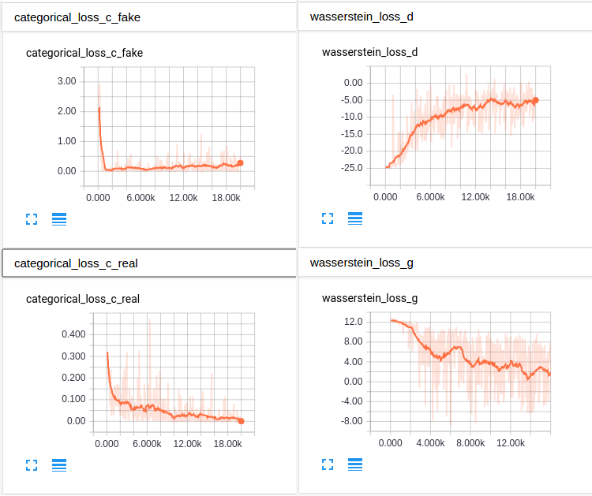
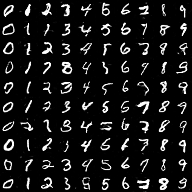

# Conditional WassersteinGAN with Auxiliary Classifier
Tensorflow implementation of a conditional WassersteinGAN. Based on the recent paper [Wasserstein GAN](https://arxiv.org/abs/1701.07875).

Note: I will interchangably use term discriminators and critic.

1. [Prerequisites](#prerequisites)
2. [Network Structure](#network-structure)
3. [Thoughts](#thoughts)
4. [Result](#result)
5. [References](#references)

## Prerequisites
- Code was tested with Linux 
- Tensorflow v1.0. Older versions may need to do some renaming manually.
- To train, call `main()` in WGAN_AC.py. To test, call `test()`.

## Network Structure
- The network structure inside generator and discriminator are built in a way similar to DCGAN, which is different from the PyTorch implementation by the authors.
- Because of the characteristics of WassersteinGAN, I have to use a separate classifier to enforce the condition. See next section.
- Generator --------> Discriminator ---> Wasserstein Distance  
|  
|----> Classifier ---> *class1, class2, ..., classN*

## Thoughts
- The WassersteinGAN solved several problems in traditional GAN, including mode collapse and the instability in training. So I think it is worth investigating a little more to train a conditional WassersteinGAN.
- Initial tries on training conditional WassersteinGAN all failed because the critic in WassersteinGAN is no longer doing classification, so the traditional ways like [CGAN](https://arxiv.org/abs/1411.1784) will not work. 
- The separate classifier is inspired by [Conditional Image Synthesis With Auxiliary Classifier GANs](https://arxiv.org/abs/1610.09585). In their original structure, the discriminator will also output classification loss and optimize that together with loss on real/fake, but the trick does not work here because the classification loss will be dominated by the Wasserstein distance.
- One drawback of using a separate classifier is that the balance between the generator and the classifier need to be noticed. Because the training on classifier also affect the generator, if the classifier is trained for too many iterations, it will make the discriminator hard to converge. In my implementation I just use some simple math trick so that proportion of number of iterations on the generator and the discriminator still remains roughly 1:5, as in the original implementation of WassersteinGAN.
- The training is slower than the original WassersteinGAN. This makes sense because it will take the optimizer more effort to find the correct direction. I increased the learning rate so the training can be a little faster.
- The change of losses during training:  
 

## Result

- As you can see, the results are not perfect. Some categories still have some other digits mixed into them. This may be caused by the conflict between Wasserstein distance and the classification loss function(which is cross entropy), but I have not found a better way to solve the problem. More iterations could improve the results a little more, but not much.

## References
- The original tensorflow implementation of WassersteinGAN is adopted from Zardinality's work - [link](https://github.com/Zardinality/WGAN-tensorflow)
- AC-GAN implementation by buriburisuri - [link](https://github.com/buriburisuri/ac-gan)
